# Projects and dependencies analysis

This document provides a comprehensive overview of the projects and their dependencies in the context of upgrading to .NETCoreApp,Version=v10.0.

## Table of Contents

- [Executive Summary](#executive-Summary)
  - [Highlevel Metrics](#highlevel-metrics)
  - [Projects Compatibility](#projects-compatibility)
  - [Package Compatibility](#package-compatibility)
  - [API Compatibility](#api-compatibility)
- [Aggregate NuGet packages details](#aggregate-nuget-packages-details)
- [Top API Migration Challenges](#top-api-migration-challenges)
  - [Technologies and Features](#technologies-and-features)
  - [Most Frequent API Issues](#most-frequent-api-issues)
- [Projects Relationship Graph](#projects-relationship-graph)
- [Project Details](#project-details)

  - [BinaryFiles\BinaryFiles.csproj](#binaryfilesbinaryfilescsproj)
  - [CfgDataStore\CfgDataStore.csproj](#cfgdatastorecfgdatastorecsproj)
  - [CommandPrompt\CommandPrompt.csproj](#commandpromptcommandpromptcsproj)
  - [Common\Common.csproj](#commoncommoncsproj)
  - [FormatTextControl\FormatTextControl.csproj](#formattextcontrolformattextcontrolcsproj)
  - [FormatTextControlTests\FormatTextControlTests.csproj](#formattextcontroltestsformattextcontroltestscsproj)
  - [SqlCommandCompleter\SqlCommandCompleter.csproj](#sqlcommandcompletersqlcommandcompletercsproj)
  - [SqlCommandCompleterTests\SqlCommandCompleterTests.csproj](#sqlcommandcompletertestssqlcommandcompletertestscsproj)
  - [SqlExecute\SqlExecute.csproj](#sqlexecutesqlexecutecsproj)
  - [SqlParser\SqlParser.csproj](#sqlparsersqlparsercsproj)
  - [SqlStudio\SqlStudio.csproj](#sqlstudiosqlstudiocsproj)
  - [SqlStudioTests\SqlStudioTests.csproj](#sqlstudiotestssqlstudiotestscsproj)

## Executive Summary

### Highlevel Metrics

| Metric | Count | Status |
| :--- | :---: | :--- |
| Total Projects | 12 | 11 require upgrade |
| Total NuGet Packages | 34 | 14 need upgrade |
| Total Code Files | 191 |  |
| Total Code Files with Incidents | 91 |  |
| Total Lines of Code | 23458 |  |
| Total Number of Issues | 10624 |  |
| Estimated LOC to modify | 10587+ | at least 45.1% of codebase |

### Projects Compatibility

| Project | Target Framework | Difficulty | Package Issues | API Issues | Est. LOC Impact | Description |
| :--- | :---: | :---: | :---: | :---: | :---: | :--- |
| [BinaryFiles\BinaryFiles.csproj](#binaryfilesbinaryfilescsproj) | netstandard2.0 | ✅ None | 0 | 0 |  | ClassLibrary, Sdk Style = True |
| [CfgDataStore\CfgDataStore.csproj](#cfgdatastorecfgdatastorecsproj) | net8.0-windows7.0 | 🟢 Low | 2 | 0 |  | ClassLibrary, Sdk Style = True |
| [CommandPrompt\CommandPrompt.csproj](#commandpromptcommandpromptcsproj) | net8.0-windows7.0 | 🟡 Medium | 1 | 852 | 852+ | ClassLibrary, Sdk Style = True |
| [Common\Common.csproj](#commoncommoncsproj) | net8.0 | 🟢 Low | 0 | 0 |  | ClassLibrary, Sdk Style = True |
| [FormatTextControl\FormatTextControl.csproj](#formattextcontrolformattextcontrolcsproj) | net8.0-windows7.0 | 🟡 Medium | 1 | 539 | 539+ | ClassLibrary, Sdk Style = True |
| [FormatTextControlTests\FormatTextControlTests.csproj](#formattextcontroltestsformattextcontroltestscsproj) | net8.0-windows7.0 | 🟢 Low | 0 | 0 |  | DotNetCoreApp, Sdk Style = True |
| [SqlCommandCompleter\SqlCommandCompleter.csproj](#sqlcommandcompletersqlcommandcompletercsproj) | net8.0 | 🟢 Low | 1 | 0 |  | ClassLibrary, Sdk Style = True |
| [SqlCommandCompleterTests\SqlCommandCompleterTests.csproj](#sqlcommandcompletertestssqlcommandcompletertestscsproj) | net8.0 | 🟢 Low | 2 | 0 |  | DotNetCoreApp, Sdk Style = True |
| [SqlExecute\SqlExecute.csproj](#sqlexecutesqlexecutecsproj) | net8.0-windows7.0 | 🟢 Low | 5 | 16 | 16+ | ClassLibrary, Sdk Style = True |
| [SqlParser\SqlParser.csproj](#sqlparsersqlparsercsproj) | netstandard2.0 | 🟢 Low | 1 | 0 |  | ClassLibrary, Sdk Style = True |
| [SqlStudio\SqlStudio.csproj](#sqlstudiosqlstudiocsproj) | net8.0-windows7.0 | 🟡 Medium | 10 | 9180 | 9180+ | WinForms, Sdk Style = True |
| [SqlStudioTests\SqlStudioTests.csproj](#sqlstudiotestssqlstudiotestscsproj) | net8.0-windows7.0 | 🟢 Low | 4 | 0 |  | DotNetCoreApp, Sdk Style = True |

### Package Compatibility

| Status | Count | Percentage |
| :--- | :---: | :---: |
| ✅ Compatible | 20 | 58.8% |
| ⚠️ Incompatible | 2 | 5.9% |
| 🔄 Upgrade Recommended | 12 | 35.3% |
| ***Total NuGet Packages*** | ***34*** | ***100%*** |

### API Compatibility

| Category | Count | Impact |
| :--- | :---: | :--- |
| 🔴 Binary Incompatible | 10217 | High - Require code changes |
| 🟡 Source Incompatible | 363 | Medium - Needs re-compilation and potential conflicting API error fixing |
| 🔵 Behavioral change | 7 | Low - Behavioral changes that may require testing at runtime |
| ✅ Compatible | 19438 |  |
| ***Total APIs Analyzed*** | ***30025*** |  |

## Aggregate NuGet packages details

| Package | Current Version | Suggested Version | Projects | Description |
| :--- | :---: | :---: | :--- | :--- |
| coverlet.collector | 6.0.4 |  | [FormatTextControlTests.csproj](#formattextcontroltestsformattextcontroltestscsproj) | ✅Compatible |
| K4os.Compression.LZ4.Streams | 1.3.8 |  | [SqlExecute.csproj](#sqlexecutesqlexecutecsproj) | ✅Compatible |
| K4os.Hash.xxHash | 1.0.8 |  | [SqlExecute.csproj](#sqlexecutesqlexecutecsproj) | ✅Compatible |
| Microsoft.CSharp | 4.7.0 |  | [SqlCommandCompleter.csproj](#sqlcommandcompletersqlcommandcompletercsproj) [SqlExecute.csproj](#sqlexecutesqlexecutecsproj) [SqlParser.csproj](#sqlparsersqlparsercsproj) | ✅Compatible |
| Microsoft.DotNet.UpgradeAssistant.Extensions.Default.Analyzers | 0.4.421302 |  | [BinaryFiles.csproj](#binaryfilesbinaryfilescsproj) [CommandPrompt.csproj](#commandpromptcommandpromptcsproj) [FormatTextControl.csproj](#formattextcontrolformattextcontrolcsproj) [SqlCommandCompleter.csproj](#sqlcommandcompletersqlcommandcompletercsproj) [SqlCommandCompleterTests.csproj](#sqlcommandcompletertestssqlcommandcompletertestscsproj) [SqlExecute.csproj](#sqlexecutesqlexecutecsproj) [SqlParser.csproj](#sqlparsersqlparsercsproj) [SqlStudio.csproj](#sqlstudiosqlstudiocsproj) [SqlStudioTests.csproj](#sqlstudiotestssqlstudiotestscsproj) | ✅Compatible |
| Microsoft.EntityFrameworkCore | 9.0.1 | 10.0.3 | [CfgDataStore.csproj](#cfgdatastorecfgdatastorecsproj) | NuGet package upgrade is recommended |
| Microsoft.EntityFrameworkCore.Sqlite | 9.0.1 | 10.0.3 | [SqlStudio.csproj](#sqlstudiosqlstudiocsproj) | NuGet package upgrade is recommended |
| Microsoft.EntityFrameworkCore.Sqlite.Core | 9.0.1 | 10.0.3 | [CfgDataStore.csproj](#cfgdatastorecfgdatastorecsproj) | NuGet package upgrade is recommended |
| Microsoft.Extensions.Caching.Memory | 9.0.1 | 10.0.3 | [SqlStudio.csproj](#sqlstudiosqlstudiocsproj) | NuGet package upgrade is recommended |
| Microsoft.Extensions.Configuration.Binder | 9.0.1 | 10.0.3 | [SqlStudio.csproj](#sqlstudiosqlstudiocsproj) [SqlStudioTests.csproj](#sqlstudiotestssqlstudiotestscsproj) | NuGet package upgrade is recommended |
| Microsoft.Extensions.Hosting | 9.0.1 | 10.0.3 | [SqlStudio.csproj](#sqlstudiosqlstudiocsproj) | NuGet package upgrade is recommended |
| Microsoft.Extensions.Identity.Core | 9.0.1 | 10.0.3 | [SqlStudio.csproj](#sqlstudiosqlstudiocsproj) | NuGet package upgrade is recommended |
| Microsoft.Extensions.Logging | 9.0.1 | 10.0.3 | [SqlStudio.csproj](#sqlstudiosqlstudiocsproj) [SqlStudioTests.csproj](#sqlstudiotestssqlstudiotestscsproj) | NuGet package upgrade is recommended |
| Microsoft.NET.Test.Sdk | 17.12.0 |  | [FormatTextControlTests.csproj](#formattextcontroltestsformattextcontroltestscsproj) [SqlCommandCompleterTests.csproj](#sqlcommandcompletertestssqlcommandcompletertestscsproj) [SqlStudioTests.csproj](#sqlstudiotestssqlstudiotestscsproj) | ✅Compatible |
| Microsoft.SqlServer.TransactSql.ScriptDom | 170.18.0 |  | [SqlParser.csproj](#sqlparsersqlparsercsproj) | ✅Compatible |
| Microsoft.Windows.Compatibility | 9.0.1 | 10.0.3 | [CommandPrompt.csproj](#commandpromptcommandpromptcsproj) [FormatTextControl.csproj](#formattextcontrolformattextcontrolcsproj) [SqlExecute.csproj](#sqlexecutesqlexecutecsproj) | NuGet package upgrade is recommended |
| Moq | 4.20.72 |  | [SqlCommandCompleterTests.csproj](#sqlcommandcompletertestssqlcommandcompletertestscsproj) [SqlStudioTests.csproj](#sqlstudiotestssqlstudiotestscsproj) | ✅Compatible |
| MSTest.TestAdapter | 3.7.3 |  | [FormatTextControlTests.csproj](#formattextcontroltestsformattextcontroltestscsproj) [SqlCommandCompleterTests.csproj](#sqlcommandcompletertestssqlcommandcompletertestscsproj) [SqlStudioTests.csproj](#sqlstudiotestssqlstudiotestscsproj) | ✅Compatible |
| MSTest.TestFramework | 3.7.3 |  | [FormatTextControlTests.csproj](#formattextcontroltestsformattextcontroltestscsproj) [SqlCommandCompleterTests.csproj](#sqlcommandcompletertestssqlcommandcompletertestscsproj) [SqlStudioTests.csproj](#sqlstudiotestssqlstudiotestscsproj) | ✅Compatible |
| MySql.Data | 9.2.0 |  | [SqlExecute.csproj](#sqlexecutesqlexecutecsproj) | ✅Compatible |
| NETStandard.Library | 2.0.3 |  | [BinaryFiles.csproj](#binaryfilesbinaryfilescsproj) [SqlParser.csproj](#sqlparsersqlparsercsproj) | ✅Compatible |
| Npgsql | 9.0.2 |  | [SqlExecute.csproj](#sqlexecutesqlexecutecsproj) | ✅Compatible |
| Oracle.ManagedDataAccess.Core | 23.7.0 |  | [SqlExecute.csproj](#sqlexecutesqlexecutecsproj) | ✅Compatible |
| PoorMansTSqlFormatterRedux | 1.0.3 |  | [SqlStudio.csproj](#sqlstudiosqlstudiocsproj) | ⚠️NuGet package is deprecated |
| SQLitePCLRaw.bundle_e_sqlite3 | 2.1.10 |  | [SqlExecute.csproj](#sqlexecutesqlexecutecsproj) [SqlStudio.csproj](#sqlstudiosqlstudiocsproj) | ✅Compatible |
| System.ComponentModel.Annotations | 5.0.0 |  | [SqlExecute.csproj](#sqlexecutesqlexecutecsproj) [SqlStudio.csproj](#sqlstudiosqlstudiocsproj) | NuGet package functionality is included with framework reference |
| System.Configuration.ConfigurationManager | 9.0.1 | 10.0.3 | [SqlCommandCompleterTests.csproj](#sqlcommandcompletertestssqlcommandcompletertestscsproj) [SqlStudioTests.csproj](#sqlstudiotestssqlstudiotestscsproj) | NuGet package upgrade is recommended |
| System.Data.DataSetExtensions | 4.5.0 |  | [SqlCommandCompleter.csproj](#sqlcommandcompletersqlcommandcompletercsproj) [SqlParser.csproj](#sqlparsersqlparsercsproj) | NuGet package functionality is included with framework reference |
| System.Data.SQLite | 1.0.119 |  | [SqlExecute.csproj](#sqlexecutesqlexecutecsproj) [SqlStudio.csproj](#sqlstudiosqlstudiocsproj) | ⚠️NuGet package is deprecated |
| System.Linq.Dynamic.Core | 1.6.0 |  | [SqlStudio.csproj](#sqlstudiosqlstudiocsproj) | ✅Compatible |
| System.Memory | 4.6.0 |  | [SqlExecute.csproj](#sqlexecutesqlexecutecsproj) [SqlStudio.csproj](#sqlstudiosqlstudiocsproj) | NuGet package functionality is included with framework reference |
| System.Runtime.CompilerServices.Unsafe | 6.1.0 | 6.1.2 | [SqlCommandCompleterTests.csproj](#sqlcommandcompletertestssqlcommandcompletertestscsproj) [SqlStudioTests.csproj](#sqlstudiotestssqlstudiotestscsproj) | NuGet package upgrade is recommended |
| System.Text.Json | 9.0.1 | 10.0.3 | [SqlExecute.csproj](#sqlexecutesqlexecutecsproj) | NuGet package upgrade is recommended |
| System.Windows.Forms.DataVisualization | 1.0.0-prerelease.20110.1 |  | [SqlStudio.csproj](#sqlstudiosqlstudiocsproj) | ✅Compatible |

## Top API Migration Challenges

### Technologies and Features

| Technology | Issues | Percentage | Migration Path |
| :--- | :---: | :---: | :--- |
| Windows Forms | 10283 | 97.1% | Windows Forms APIs for building Windows desktop applications with traditional Forms-based UI that are available in .NET on Windows. Enable Windows Desktop support: Option 1 (Recommended): Target net9.0-windows; Option 2: Add <UseWindowsDesktop>true</UseWindowsDesktop>; Option 3 (Legacy): Use Microsoft.NET.Sdk.WindowsDesktop SDK. |
| Windows Forms Legacy Controls | 898 | 8.5% | Legacy Windows Forms controls that have been removed from .NET Core/5+ including StatusBar, DataGrid, ContextMenu, MainMenu, MenuItem, and ToolBar. These controls were replaced by more modern alternatives. Use ToolStrip, MenuStrip, ContextMenuStrip, and DataGridView instead. |
| GDI+ / System.Drawing | 278 | 2.6% | System.Drawing APIs for 2D graphics, imaging, and printing that are available via NuGet package System.Drawing.Common. Note: Not recommended for server scenarios due to Windows dependencies; consider cross-platform alternatives like SkiaSharp or ImageSharp for new code. |
| Legacy Configuration System | 2 | 0.0% | Legacy XML-based configuration system (app.config/web.config) that has been replaced by a more flexible configuration model in .NET Core. The old system was rigid and XML-based. Migrate to Microsoft.Extensions.Configuration with JSON/environment variables; use System.Configuration.ConfigurationManager NuGet package as interim bridge if needed. |

### Most Frequent API Issues

| API | Count | Percentage | Category |
| :--- | :---: | :---: | :--- |
| T:System.Windows.Forms.ToolStripMenuItem | 512 | 4.8% | Binary Incompatible |
| T:System.Windows.Forms.Button | 500 | 4.7% | Binary Incompatible |
| T:System.Windows.Forms.TextBox | 495 | 4.7% | Binary Incompatible |
| T:System.Windows.Forms.AnchorStyles | 454 | 4.3% | Binary Incompatible |
| T:System.Windows.Forms.Label | 252 | 2.4% | Binary Incompatible |
| T:System.Windows.Forms.DialogResult | 230 | 2.2% | Binary Incompatible |
| T:System.Windows.Forms.Control.ControlCollection | 181 | 1.7% | Binary Incompatible |
| P:System.Windows.Forms.Control.Controls | 181 | 1.7% | Binary Incompatible |
| T:System.Windows.Forms.CheckBox | 171 | 1.6% | Binary Incompatible |
| M:System.Windows.Forms.Control.ControlCollection.Add(System.Windows.Forms.Control) | 162 | 1.5% | Binary Incompatible |
| P:System.Windows.Forms.TextBox.Text | 151 | 1.4% | Binary Incompatible |
| P:System.Windows.Forms.Control.Name | 151 | 1.4% | Binary Incompatible |
| P:System.Windows.Forms.Control.Location | 136 | 1.3% | Binary Incompatible |
| T:System.Windows.Forms.ToolStripItemCollection | 135 | 1.3% | Binary Incompatible |
| P:System.Windows.Forms.Control.Size | 134 | 1.3% | Binary Incompatible |
| E:System.Windows.Forms.ToolStripItem.Click | 125 | 1.2% | Binary Incompatible |
| P:System.Windows.Forms.Control.TabIndex | 122 | 1.2% | Binary Incompatible |
| T:System.Windows.Forms.Keys | 107 | 1.0% | Binary Incompatible |
| T:System.Windows.Forms.ContextMenuStrip | 107 | 1.0% | Binary Incompatible |
| M:System.Windows.Forms.ToolStripItemCollection.Add(System.Windows.Forms.ToolStripItem) | 105 | 1.0% | Binary Incompatible |
| T:System.Windows.Forms.DockStyle | 102 | 1.0% | Binary Incompatible |
| M:System.Windows.Forms.ToolStripMenuItem.#ctor(System.String) | 96 | 0.9% | Binary Incompatible |
| T:System.Windows.Forms.TabPage | 96 | 0.9% | Binary Incompatible |
| T:System.Windows.Forms.GroupBox | 79 | 0.7% | Binary Incompatible |
| T:System.Windows.Forms.DataGridViewCell | 77 | 0.7% | Binary Incompatible |
| P:System.Windows.Forms.ToolStrip.Items | 75 | 0.7% | Binary Incompatible |
| T:System.Windows.Forms.AutoScaleMode | 72 | 0.7% | Binary Incompatible |
| F:System.Windows.Forms.AnchorStyles.Right | 71 | 0.7% | Binary Incompatible |
| P:System.Windows.Forms.ToolStripItem.Text | 71 | 0.7% | Binary Incompatible |
| P:System.Windows.Forms.Control.Anchor | 70 | 0.7% | Binary Incompatible |
| P:System.Windows.Forms.ToolStripItem.Name | 67 | 0.6% | Binary Incompatible |
| P:System.Windows.Forms.ToolStripItem.Size | 65 | 0.6% | Binary Incompatible |
| P:System.Windows.Forms.Control.ContextMenuStrip | 64 | 0.6% | Binary Incompatible |
| T:System.Windows.Forms.Control | 64 | 0.6% | Binary Incompatible |
| T:System.Windows.Forms.ListBox | 62 | 0.6% | Binary Incompatible |
| P:System.Windows.Forms.ToolStripDropDownItem.DropDownItems | 60 | 0.6% | Binary Incompatible |
| T:System.Windows.Forms.ToolStripSeparator | 60 | 0.6% | Binary Incompatible |
| T:System.Windows.Forms.DateTimePicker | 57 | 0.5% | Binary Incompatible |
| P:System.Windows.Forms.CheckBox.Checked | 53 | 0.5% | Binary Incompatible |
| P:System.Windows.Forms.Control.Enabled | 52 | 0.5% | Binary Incompatible |
| T:System.Windows.Forms.ErrorProvider | 52 | 0.5% | Binary Incompatible |
| T:System.Windows.Forms.Padding | 52 | 0.5% | Binary Incompatible |
| T:System.Windows.Forms.ToolStripButton | 51 | 0.5% | Binary Incompatible |
| P:System.Windows.Forms.ButtonBase.Text | 49 | 0.5% | Binary Incompatible |
| M:System.Windows.Forms.ToolStripMenuItem.#ctor | 49 | 0.5% | Binary Incompatible |
| P:System.Windows.Forms.ButtonBase.UseVisualStyleBackColor | 48 | 0.5% | Binary Incompatible |
| P:System.Windows.Forms.Control.Width | 47 | 0.4% | Binary Incompatible |
| T:System.Windows.Forms.DataGridViewSelectedCellCollection | 46 | 0.4% | Binary Incompatible |
| P:System.Windows.Forms.DataGridView.SelectedCells | 46 | 0.4% | Binary Incompatible |
| T:System.Windows.Forms.TabControl.TabPageCollection | 46 | 0.4% | Binary Incompatible |

## Projects Relationship Graph

Legend:
📦 SDK-style project
⚙️ Classic project

```mermaid
flowchart LR
    P1["<b>📦&nbsp;SqlStudio.csproj</b><br/><small>net8.0-windows7.0</small>"]
    P2["<b>📦&nbsp;FormatTextControl.csproj</b><br/><small>net8.0-windows7.0</small>"]
    P3["<b>📦&nbsp;CommandPrompt.csproj</b><br/><small>net8.0-windows7.0</small>"]
    P4["<b>📦&nbsp;SqlExecute.csproj</b><br/><small>net8.0-windows7.0</small>"]
    P5["<b>📦&nbsp;BinaryFiles.csproj</b><br/><small>netstandard2.0</small>"]
    P6["<b>📦&nbsp;CfgDataStore.csproj</b><br/><small>net8.0-windows7.0</small>"]
    P7["<b>📦&nbsp;SqlStudioTests.csproj</b><br/><small>net8.0-windows7.0</small>"]
    P8["<b>📦&nbsp;Common.csproj</b><br/><small>net8.0</small>"]
    P9["<b>📦&nbsp;SqlParser.csproj</b><br/><small>netstandard2.0</small>"]
    P10["<b>📦&nbsp;SqlCommandCompleter.csproj</b><br/><small>net8.0</small>"]
    P11["<b>📦&nbsp;SqlCommandCompleterTests.csproj</b><br/><small>net8.0</small>"]
    P12["<b>📦&nbsp;FormatTextControlTests.csproj</b><br/><small>net8.0-windows7.0</small>"]
    P1 --> P3
    P1 --> P5
    P1 --> P8
    P1 --> P2
    P1 --> P10
    P1 --> P4
    P1 --> P6
    P3 --> P8
    P3 --> P2
    P3 --> P6
    P4 --> P8
    P6 --> P8
    P6 --> P4
    P7 --> P9
    P7 --> P3
    P7 --> P1
    P10 --> P8
    P11 --> P8
    P11 --> P10
    P12 --> P8
    P12 --> P2
    click P1 "#sqlstudiosqlstudiocsproj"
    click P2 "#formattextcontrolformattextcontrolcsproj"
    click P3 "#commandpromptcommandpromptcsproj"
    click P4 "#sqlexecutesqlexecutecsproj"
    click P5 "#binaryfilesbinaryfilescsproj"
    click P6 "#cfgdatastorecfgdatastorecsproj"
    click P7 "#sqlstudiotestssqlstudiotestscsproj"
    click P8 "#commoncommoncsproj"
    click P9 "#sqlparsersqlparsercsproj"
    click P10 "#sqlcommandcompletersqlcommandcompletercsproj"
    click P11 "#sqlcommandcompletertestssqlcommandcompletertestscsproj"
    click P12 "#formattextcontroltestsformattextcontroltestscsproj"

```

## Project Details

### BinaryFiles\BinaryFiles.csproj

#### Project Info

- **Current Target Framework:** netstandard2.0✅
- **SDK-style**: True
- **Project Kind:** ClassLibrary
- **Dependencies**: 0
- **Dependants**: 1
- **Number of Files**: 0
- **Lines of Code**: 0
- **Estimated LOC to modify**: 0+ (at least 0.0% of the project)

#### Dependency Graph

Legend:
📦 SDK-style project
⚙️ Classic project

```mermaid
flowchart TB
    subgraph upstream["Dependants (1)"]
        P1["<b>📦&nbsp;SqlStudio.csproj</b><br/><small>net8.0-windows7.0</small>"]
        click P1 "#sqlstudiosqlstudiocsproj"
    end
    subgraph current["BinaryFiles.csproj"]
        MAIN["<b>📦&nbsp;BinaryFiles.csproj</b><br/><small>netstandard2.0</small>"]
        click MAIN "#binaryfilesbinaryfilescsproj"
    end
    P1 --> MAIN

```

### API Compatibility

| Category | Count | Impact |
| :--- | :---: | :--- |
| 🔴 Binary Incompatible | 0 | High - Require code changes |
| 🟡 Source Incompatible | 0 | Medium - Needs re-compilation and potential conflicting API error fixing |
| 🔵 Behavioral change | 0 | Low - Behavioral changes that may require testing at runtime |
| ✅ Compatible | 0 |  |
| ***Total APIs Analyzed*** | ***0*** |  |

### CfgDataStore\CfgDataStore.csproj

#### Project Info

- **Current Target Framework:** net8.0-windows7.0
- **Proposed Target Framework:** net10.0--windows7.0
- **SDK-style**: True
- **Project Kind:** ClassLibrary
- **Dependencies**: 2
- **Dependants**: 2
- **Number of Files**: 11
- **Number of Files with Incidents**: 1
- **Lines of Code**: 653
- **Estimated LOC to modify**: 0+ (at least 0.0% of the project)

#### Dependency Graph

Legend:
📦 SDK-style project
⚙️ Classic project

```mermaid
flowchart TB
    subgraph upstream["Dependants (2)"]
        P1["<b>📦&nbsp;SqlStudio.csproj</b><br/><small>net8.0-windows7.0</small>"]
        P3["<b>📦&nbsp;CommandPrompt.csproj</b><br/><small>net8.0-windows7.0</small>"]
        click P1 "#sqlstudiosqlstudiocsproj"
        click P3 "#commandpromptcommandpromptcsproj"
    end
    subgraph current["CfgDataStore.csproj"]
        MAIN["<b>📦&nbsp;CfgDataStore.csproj</b><br/><small>net8.0-windows7.0</small>"]
        click MAIN "#cfgdatastorecfgdatastorecsproj"
    end
    subgraph downstream["Dependencies (2"]
        P8["<b>📦&nbsp;Common.csproj</b><br/><small>net8.0</small>"]
        P4["<b>📦&nbsp;SqlExecute.csproj</b><br/><small>net8.0-windows7.0</small>"]
        click P8 "#commoncommoncsproj"
        click P4 "#sqlexecutesqlexecutecsproj"
    end
    P1 --> MAIN
    P3 --> MAIN
    MAIN --> P8
    MAIN --> P4

```

### API Compatibility

| Category | Count | Impact |
| :--- | :---: | :--- |
| 🔴 Binary Incompatible | 0 | High - Require code changes |
| 🟡 Source Incompatible | 0 | Medium - Needs re-compilation and potential conflicting API error fixing |
| 🔵 Behavioral change | 0 | Low - Behavioral changes that may require testing at runtime |
| ✅ Compatible | 584 |  |
| ***Total APIs Analyzed*** | ***584*** |  |

### CommandPrompt\CommandPrompt.csproj

#### Project Info

- **Current Target Framework:** net8.0-windows7.0
- **Proposed Target Framework:** net10.0--windows7.0
- **SDK-style**: True
- **Project Kind:** ClassLibrary
- **Dependencies**: 3
- **Dependants**: 2
- **Number of Files**: 17
- **Number of Files with Incidents**: 11
- **Lines of Code**: 1344
- **Estimated LOC to modify**: 852+ (at least 63.4% of the project)

#### Dependency Graph

Legend:
📦 SDK-style project
⚙️ Classic project

```mermaid
flowchart TB
    subgraph upstream["Dependants (2)"]
        P1["<b>📦&nbsp;SqlStudio.csproj</b><br/><small>net8.0-windows7.0</small>"]
        P7["<b>📦&nbsp;SqlStudioTests.csproj</b><br/><small>net8.0-windows7.0</small>"]
        click P1 "#sqlstudiosqlstudiocsproj"
        click P7 "#sqlstudiotestssqlstudiotestscsproj"
    end
    subgraph current["CommandPrompt.csproj"]
        MAIN["<b>📦&nbsp;CommandPrompt.csproj</b><br/><small>net8.0-windows7.0</small>"]
        click MAIN "#commandpromptcommandpromptcsproj"
    end
    subgraph downstream["Dependencies (3"]
        P8["<b>📦&nbsp;Common.csproj</b><br/><small>net8.0</small>"]
        P2["<b>📦&nbsp;FormatTextControl.csproj</b><br/><small>net8.0-windows7.0</small>"]
        P6["<b>📦&nbsp;CfgDataStore.csproj</b><br/><small>net8.0-windows7.0</small>"]
        click P8 "#commoncommoncsproj"
        click P2 "#formattextcontrolformattextcontrolcsproj"
        click P6 "#cfgdatastorecfgdatastorecsproj"
    end
    P1 --> MAIN
    P7 --> MAIN
    MAIN --> P8
    MAIN --> P2
    MAIN --> P6

```

### API Compatibility

| Category | Count | Impact |
| :--- | :---: | :--- |
| 🔴 Binary Incompatible | 843 | High - Require code changes |
| 🟡 Source Incompatible | 9 | Medium - Needs re-compilation and potential conflicting API error fixing |
| 🔵 Behavioral change | 0 | Low - Behavioral changes that may require testing at runtime |
| ✅ Compatible | 941 |  |
| ***Total APIs Analyzed*** | ***1793*** |  |

#### Project Technologies and Features

| Technology | Issues | Percentage | Migration Path |
| :--- | :---: | :---: | :--- |
| GDI+ / System.Drawing | 9 | 1.1% | System.Drawing APIs for 2D graphics, imaging, and printing that are available via NuGet package System.Drawing.Common. Note: Not recommended for server scenarios due to Windows dependencies; consider cross-platform alternatives like SkiaSharp or ImageSharp for new code. |
| Windows Forms Legacy Controls | 4 | 0.5% | Legacy Windows Forms controls that have been removed from .NET Core/5+ including StatusBar, DataGrid, ContextMenu, MainMenu, MenuItem, and ToolBar. These controls were replaced by more modern alternatives. Use ToolStrip, MenuStrip, ContextMenuStrip, and DataGridView instead. |
| Windows Forms | 843 | 98.9% | Windows Forms APIs for building Windows desktop applications with traditional Forms-based UI that are available in .NET on Windows. Enable Windows Desktop support: Option 1 (Recommended): Target net9.0-windows; Option 2: Add <UseWindowsDesktop>true</UseWindowsDesktop>; Option 3 (Legacy): Use Microsoft.NET.Sdk.WindowsDesktop SDK. |

### Common\Common.csproj

#### Project Info

- **Current Target Framework:** net8.0
- **Proposed Target Framework:** net10.0
- **SDK-style**: True
- **Project Kind:** ClassLibrary
- **Dependencies**: 0
- **Dependants**: 7
- **Number of Files**: 20
- **Number of Files with Incidents**: 1
- **Lines of Code**: 328
- **Estimated LOC to modify**: 0+ (at least 0.0% of the project)

#### Dependency Graph

Legend:
📦 SDK-style project
⚙️ Classic project

### API Compatibility

| Category | Count | Impact |
| :--- | :---: | :--- |
| 🔴 Binary Incompatible | 0 | High - Require code changes |
| 🟡 Source Incompatible | 0 | Medium - Needs re-compilation and potential conflicting API error fixing |
| 🔵 Behavioral change | 0 | Low - Behavioral changes that may require testing at runtime |
| ✅ Compatible | 288 |  |
| ***Total APIs Analyzed*** | ***288*** |  |

### FormatTextControl\FormatTextControl.csproj

#### Project Info

- **Current Target Framework:** net8.0-windows7.0
- **Proposed Target Framework:** net10.0--windows7.0
- **SDK-style**: True
- **Project Kind:** ClassLibrary
- **Dependencies**: 0
- **Dependants**: 3
- **Number of Files**: 12
- **Number of Files with Incidents**: 5
- **Lines of Code**: 2652
- **Estimated LOC to modify**: 539+ (at least 20.3% of the project)

#### Dependency Graph

Legend:
📦 SDK-style project
⚙️ Classic project

```mermaid
flowchart TB
    subgraph upstream["Dependants (3)"]
        P1["<b>📦&nbsp;SqlStudio.csproj</b><br/><small>net8.0-windows7.0</small>"]
        P3["<b>📦&nbsp;CommandPrompt.csproj</b><br/><small>net8.0-windows7.0</small>"]
        P12["<b>📦&nbsp;FormatTextControlTests.csproj</b><br/><small>net8.0-windows7.0</small>"]
        click P1 "#sqlstudiosqlstudiocsproj"
        click P3 "#commandpromptcommandpromptcsproj"
        click P12 "#formattextcontroltestsformattextcontroltestscsproj"
    end
    subgraph current["FormatTextControl.csproj"]
        MAIN["<b>📦&nbsp;FormatTextControl.csproj</b><br/><small>net8.0-windows7.0</small>"]
        click MAIN "#formattextcontrolformattextcontrolcsproj"
    end
    P1 --> MAIN
    P3 --> MAIN
    P12 --> MAIN

```

### API Compatibility

| Category | Count | Impact |
| :--- | :---: | :--- |
| 🔴 Binary Incompatible | 401 | High - Require code changes |
| 🟡 Source Incompatible | 137 | Medium - Needs re-compilation and potential conflicting API error fixing |
| 🔵 Behavioral change | 1 | Low - Behavioral changes that may require testing at runtime |
| ✅ Compatible | 2106 |  |
| ***Total APIs Analyzed*** | ***2645*** |  |

#### Project Technologies and Features

| Technology | Issues | Percentage | Migration Path |
| :--- | :---: | :---: | :--- |
| Windows Forms Legacy Controls | 14 | 2.6% | Legacy Windows Forms controls that have been removed from .NET Core/5+ including StatusBar, DataGrid, ContextMenu, MainMenu, MenuItem, and ToolBar. These controls were replaced by more modern alternatives. Use ToolStrip, MenuStrip, ContextMenuStrip, and DataGridView instead. |
| GDI+ / System.Drawing | 137 | 25.4% | System.Drawing APIs for 2D graphics, imaging, and printing that are available via NuGet package System.Drawing.Common. Note: Not recommended for server scenarios due to Windows dependencies; consider cross-platform alternatives like SkiaSharp or ImageSharp for new code. |
| Windows Forms | 401 | 74.4% | Windows Forms APIs for building Windows desktop applications with traditional Forms-based UI that are available in .NET on Windows. Enable Windows Desktop support: Option 1 (Recommended): Target net9.0-windows; Option 2: Add <UseWindowsDesktop>true</UseWindowsDesktop>; Option 3 (Legacy): Use Microsoft.NET.Sdk.WindowsDesktop SDK. |

### FormatTextControlTests\FormatTextControlTests.csproj

#### Project Info

- **Current Target Framework:** net8.0-windows7.0
- **Proposed Target Framework:** net10.0--windows7.0
- **SDK-style**: True
- **Project Kind:** DotNetCoreApp
- **Dependencies**: 2
- **Dependants**: 0
- **Number of Files**: 4
- **Number of Files with Incidents**: 1
- **Lines of Code**: 85
- **Estimated LOC to modify**: 0+ (at least 0.0% of the project)

#### Dependency Graph

Legend:
📦 SDK-style project
⚙️ Classic project

```mermaid
flowchart TB
    subgraph current["FormatTextControlTests.csproj"]
        MAIN["<b>📦&nbsp;FormatTextControlTests.csproj</b><br/><small>net8.0-windows7.0</small>"]
        click MAIN "#formattextcontroltestsformattextcontroltestscsproj"
    end
    subgraph downstream["Dependencies (2"]
        P8["<b>📦&nbsp;Common.csproj</b><br/><small>net8.0</small>"]
        P2["<b>📦&nbsp;FormatTextControl.csproj</b><br/><small>net8.0-windows7.0</small>"]
        click P8 "#commoncommoncsproj"
        click P2 "#formattextcontrolformattextcontrolcsproj"
    end
    MAIN --> P8
    MAIN --> P2

```

### API Compatibility

| Category | Count | Impact |
| :--- | :---: | :--- |
| 🔴 Binary Incompatible | 0 | High - Require code changes |
| 🟡 Source Incompatible | 0 | Medium - Needs re-compilation and potential conflicting API error fixing |
| 🔵 Behavioral change | 0 | Low - Behavioral changes that may require testing at runtime |
| ✅ Compatible | 88 |  |
| ***Total APIs Analyzed*** | ***88*** |  |

### SqlCommandCompleter\SqlCommandCompleter.csproj

#### Project Info

- **Current Target Framework:** net8.0
- **Proposed Target Framework:** net10.0
- **SDK-style**: True
- **Project Kind:** ClassLibrary
- **Dependencies**: 1
- **Dependants**: 2
- **Number of Files**: 3
- **Number of Files with Incidents**: 1
- **Lines of Code**: 494
- **Estimated LOC to modify**: 0+ (at least 0.0% of the project)

#### Dependency Graph

Legend:
📦 SDK-style project
⚙️ Classic project

```mermaid
flowchart TB
    subgraph upstream["Dependants (2)"]
        P1["<b>📦&nbsp;SqlStudio.csproj</b><br/><small>net8.0-windows7.0</small>"]
        P11["<b>📦&nbsp;SqlCommandCompleterTests.csproj</b><br/><small>net8.0</small>"]
        click P1 "#sqlstudiosqlstudiocsproj"
        click P11 "#sqlcommandcompletertestssqlcommandcompletertestscsproj"
    end
    subgraph current["SqlCommandCompleter.csproj"]
        MAIN["<b>📦&nbsp;SqlCommandCompleter.csproj</b><br/><small>net8.0</small>"]
        click MAIN "#sqlcommandcompletersqlcommandcompletercsproj"
    end
    subgraph downstream["Dependencies (1"]
        P8["<b>📦&nbsp;Common.csproj</b><br/><small>net8.0</small>"]
        click P8 "#commoncommoncsproj"
    end
    P1 --> MAIN
    P11 --> MAIN
    MAIN --> P8

```

### API Compatibility

| Category | Count | Impact |
| :--- | :---: | :--- |
| 🔴 Binary Incompatible | 0 | High - Require code changes |
| 🟡 Source Incompatible | 0 | Medium - Needs re-compilation and potential conflicting API error fixing |
| 🔵 Behavioral change | 0 | Low - Behavioral changes that may require testing at runtime |
| ✅ Compatible | 398 |  |
| ***Total APIs Analyzed*** | ***398*** |  |

### SqlCommandCompleterTests\SqlCommandCompleterTests.csproj

#### Project Info

- **Current Target Framework:** net8.0
- **Proposed Target Framework:** net10.0
- **SDK-style**: True
- **Project Kind:** DotNetCoreApp
- **Dependencies**: 2
- **Dependants**: 0
- **Number of Files**: 4
- **Number of Files with Incidents**: 1
- **Lines of Code**: 226
- **Estimated LOC to modify**: 0+ (at least 0.0% of the project)

#### Dependency Graph

Legend:
📦 SDK-style project
⚙️ Classic project

```mermaid
flowchart TB
    subgraph current["SqlCommandCompleterTests.csproj"]
        MAIN["<b>📦&nbsp;SqlCommandCompleterTests.csproj</b><br/><small>net8.0</small>"]
        click MAIN "#sqlcommandcompletertestssqlcommandcompletertestscsproj"
    end
    subgraph downstream["Dependencies (2"]
        P8["<b>📦&nbsp;Common.csproj</b><br/><small>net8.0</small>"]
        P10["<b>📦&nbsp;SqlCommandCompleter.csproj</b><br/><small>net8.0</small>"]
        click P8 "#commoncommoncsproj"
        click P10 "#sqlcommandcompletersqlcommandcompletercsproj"
    end
    MAIN --> P8
    MAIN --> P10

```

### API Compatibility

| Category | Count | Impact |
| :--- | :---: | :--- |
| 🔴 Binary Incompatible | 0 | High - Require code changes |
| 🟡 Source Incompatible | 0 | Medium - Needs re-compilation and potential conflicting API error fixing |
| 🔵 Behavioral change | 0 | Low - Behavioral changes that may require testing at runtime |
| ✅ Compatible | 290 |  |
| ***Total APIs Analyzed*** | ***290*** |  |

### SqlExecute\SqlExecute.csproj

#### Project Info

- **Current Target Framework:** net8.0-windows7.0
- **Proposed Target Framework:** net10.0--windows7.0
- **SDK-style**: True
- **Project Kind:** ClassLibrary
- **Dependencies**: 1
- **Dependants**: 2
- **Number of Files**: 15
- **Number of Files with Incidents**: 2
- **Lines of Code**: 2869
- **Estimated LOC to modify**: 16+ (at least 0.6% of the project)

#### Dependency Graph

Legend:
📦 SDK-style project
⚙️ Classic project

### API Compatibility

| Category | Count | Impact |
| :--- | :---: | :--- |
| 🔴 Binary Incompatible | 0 | High - Require code changes |
| 🟡 Source Incompatible | 16 | Medium - Needs re-compilation and potential conflicting API error fixing |
| 🔵 Behavioral change | 0 | Low - Behavioral changes that may require testing at runtime |
| ✅ Compatible | 2624 |  |
| ***Total APIs Analyzed*** | ***2640*** |  |

### SqlParser\SqlParser.csproj

#### Project Info

- **Current Target Framework:** netstandard2.0✅
- **SDK-style**: True
- **Project Kind:** ClassLibrary
- **Dependencies**: 0
- **Dependants**: 1
- **Number of Files**: 7
- **Number of Files with Incidents**: 1
- **Lines of Code**: 154
- **Estimated LOC to modify**: 0+ (at least 0.0% of the project)

#### Dependency Graph

Legend:
📦 SDK-style project
⚙️ Classic project

```mermaid
flowchart TB
    subgraph upstream["Dependants (1)"]
        P7["<b>📦&nbsp;SqlStudioTests.csproj</b><br/><small>net8.0-windows7.0</small>"]
        click P7 "#sqlstudiotestssqlstudiotestscsproj"
    end
    subgraph current["SqlParser.csproj"]
        MAIN["<b>📦&nbsp;SqlParser.csproj</b><br/><small>netstandard2.0</small>"]
        click MAIN "#sqlparsersqlparsercsproj"
    end
    P7 --> MAIN

```

### API Compatibility

| Category | Count | Impact |
| :--- | :---: | :--- |
| 🔴 Binary Incompatible | 0 | High - Require code changes |
| 🟡 Source Incompatible | 0 | Medium - Needs re-compilation and potential conflicting API error fixing |
| 🔵 Behavioral change | 0 | Low - Behavioral changes that may require testing at runtime |
| ✅ Compatible | 131 |  |
| ***Total APIs Analyzed*** | ***131*** |  |

### SqlStudio\SqlStudio.csproj

#### Project Info

- **Current Target Framework:** net8.0-windows7.0
- **Proposed Target Framework:** net10.0-windows
- **SDK-style**: True
- **Project Kind:** WinForms
- **Dependencies**: 7
- **Dependants**: 1
- **Number of Files**: 127
- **Number of Files with Incidents**: 66
- **Lines of Code**: 14360
- **Estimated LOC to modify**: 9180+ (at least 63.9% of the project)

#### Dependency Graph

Legend:
📦 SDK-style project
⚙️ Classic project

```mermaid
flowchart TB
    subgraph upstream["Dependants (1)"]
        P7["<b>📦&nbsp;SqlStudioTests.csproj</b><br/><small>net8.0-windows7.0</small>"]
        click P7 "#sqlstudiotestssqlstudiotestscsproj"
    end
    subgraph current["SqlStudio.csproj"]
        MAIN["<b>📦&nbsp;SqlStudio.csproj</b><br/><small>net8.0-windows7.0</small>"]
        click MAIN "#sqlstudiosqlstudiocsproj"
    end
    subgraph downstream["Dependencies (7"]
        P3["<b>📦&nbsp;CommandPrompt.csproj</b><br/><small>net8.0-windows7.0</small>"]
        P5["<b>📦&nbsp;BinaryFiles.csproj</b><br/><small>netstandard2.0</small>"]
        P8["<b>📦&nbsp;Common.csproj</b><br/><small>net8.0</small>"]
        P2["<b>📦&nbsp;FormatTextControl.csproj</b><br/><small>net8.0-windows7.0</small>"]
        P10["<b>📦&nbsp;SqlCommandCompleter.csproj</b><br/><small>net8.0</small>"]
        P4["<b>📦&nbsp;SqlExecute.csproj</b><br/><small>net8.0-windows7.0</small>"]
        P6["<b>📦&nbsp;CfgDataStore.csproj</b><br/><small>net8.0-windows7.0</small>"]
        click P3 "#commandpromptcommandpromptcsproj"
        click P5 "#binaryfilesbinaryfilescsproj"
        click P8 "#commoncommoncsproj"
        click P2 "#formattextcontrolformattextcontrolcsproj"
        click P10 "#sqlcommandcompletersqlcommandcompletercsproj"
        click P4 "#sqlexecutesqlexecutecsproj"
        click P6 "#cfgdatastorecfgdatastorecsproj"
    end
    P7 --> MAIN
    MAIN --> P3
    MAIN --> P5
    MAIN --> P8
    MAIN --> P2
    MAIN --> P10
    MAIN --> P4
    MAIN --> P6

```

### API Compatibility

| Category | Count | Impact |
| :--- | :---: | :--- |
| 🔴 Binary Incompatible | 8973 | High - Require code changes |
| 🟡 Source Incompatible | 201 | Medium - Needs re-compilation and potential conflicting API error fixing |
| 🔵 Behavioral change | 6 | Low - Behavioral changes that may require testing at runtime |
| ✅ Compatible | 11643 |  |
| ***Total APIs Analyzed*** | ***20823*** |  |

#### Project Technologies and Features

| Technology | Issues | Percentage | Migration Path |
| :--- | :---: | :---: | :--- |
| Legacy Configuration System | 2 | 0.0% | Legacy XML-based configuration system (app.config/web.config) that has been replaced by a more flexible configuration model in .NET Core. The old system was rigid and XML-based. Migrate to Microsoft.Extensions.Configuration with JSON/environment variables; use System.Configuration.ConfigurationManager NuGet package as interim bridge if needed. |
| Windows Forms Legacy Controls | 880 | 9.6% | Legacy Windows Forms controls that have been removed from .NET Core/5+ including StatusBar, DataGrid, ContextMenu, MainMenu, MenuItem, and ToolBar. These controls were replaced by more modern alternatives. Use ToolStrip, MenuStrip, ContextMenuStrip, and DataGridView instead. |
| GDI+ / System.Drawing | 132 | 1.4% | System.Drawing APIs for 2D graphics, imaging, and printing that are available via NuGet package System.Drawing.Common. Note: Not recommended for server scenarios due to Windows dependencies; consider cross-platform alternatives like SkiaSharp or ImageSharp for new code. |
| Windows Forms | 9039 | 98.5% | Windows Forms APIs for building Windows desktop applications with traditional Forms-based UI that are available in .NET on Windows. Enable Windows Desktop support: Option 1 (Recommended): Target net9.0-windows; Option 2: Add <UseWindowsDesktop>true</UseWindowsDesktop>; Option 3 (Legacy): Use Microsoft.NET.Sdk.WindowsDesktop SDK. |

### SqlStudioTests\SqlStudioTests.csproj

#### Project Info

- **Current Target Framework:** net8.0-windows7.0
- **Proposed Target Framework:** net10.0--windows7.0
- **SDK-style**: True
- **Project Kind:** DotNetCoreApp
- **Dependencies**: 3
- **Dependants**: 0
- **Number of Files**: 8
- **Number of Files with Incidents**: 1
- **Lines of Code**: 293
- **Estimated LOC to modify**: 0+ (at least 0.0% of the project)

#### Dependency Graph

Legend:
📦 SDK-style project
⚙️ Classic project

```mermaid
flowchart TB
    subgraph current["SqlStudioTests.csproj"]
        MAIN["<b>📦&nbsp;SqlStudioTests.csproj</b><br/><small>net8.0-windows7.0</small>"]
        click MAIN "#sqlstudiotestssqlstudiotestscsproj"
    end
    subgraph downstream["Dependencies (3"]
        P9["<b>📦&nbsp;SqlParser.csproj</b><br/><small>netstandard2.0</small>"]
        P3["<b>📦&nbsp;CommandPrompt.csproj</b><br/><small>net8.0-windows7.0</small>"]
        P1["<b>📦&nbsp;SqlStudio.csproj</b><br/><small>net8.0-windows7.0</small>"]
        click P9 "#sqlparsersqlparsercsproj"
        click P3 "#commandpromptcommandpromptcsproj"
        click P1 "#sqlstudiosqlstudiocsproj"
    end
    MAIN --> P9
    MAIN --> P3
    MAIN --> P1

```

### API Compatibility

| Category | Count | Impact |
| :--- | :---: | :--- |
| 🔴 Binary Incompatible | 0 | High - Require code changes |
| 🟡 Source Incompatible | 0 | Medium - Needs re-compilation and potential conflicting API error fixing |
| 🔵 Behavioral change | 0 | Low - Behavioral changes that may require testing at runtime |
| ✅ Compatible | 345 |  |
| ***Total APIs Analyzed*** | ***345*** |  |

